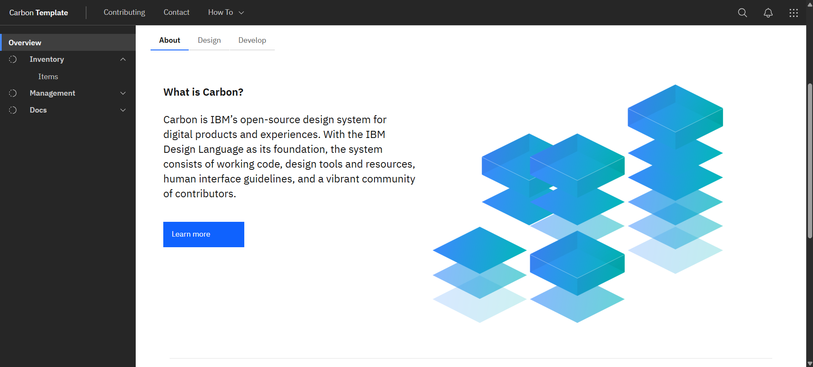
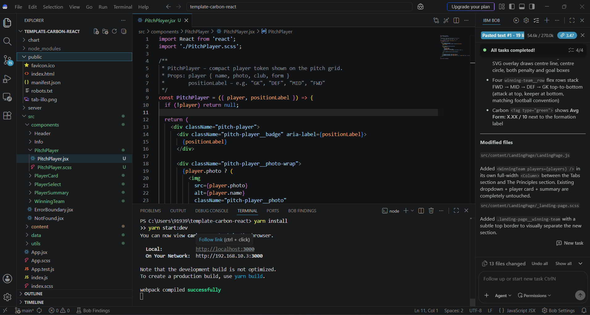
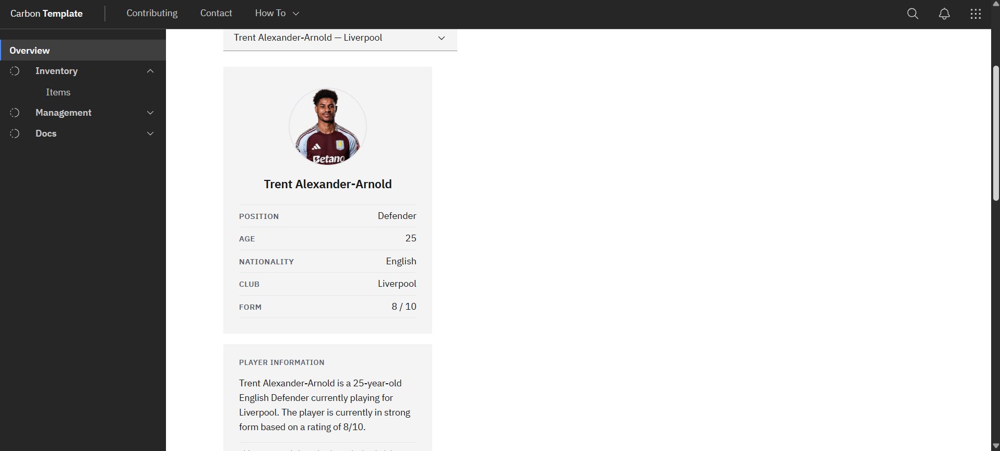
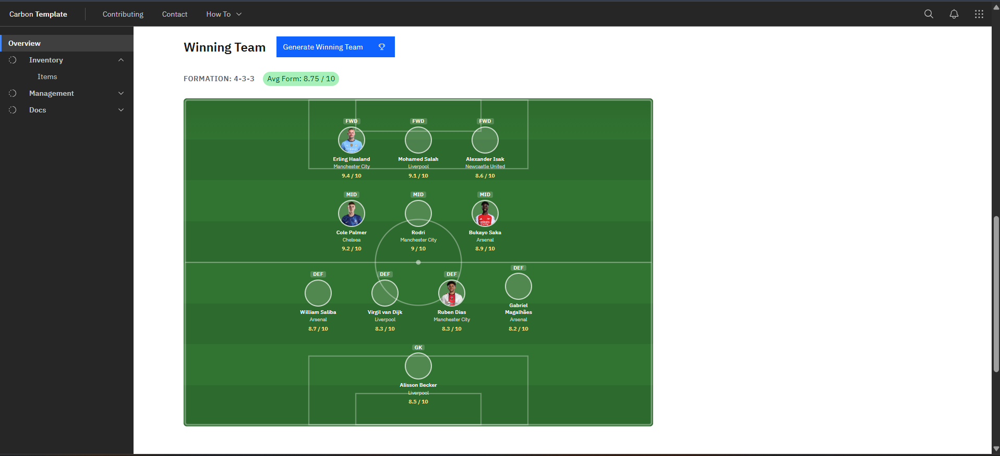

# ⚽ AI in Sports – Football Player Dashboard



## 📖 Overview

This project demonstrates the implementation of an AI-powered Football Player Dashboard using **React**, **IBM Bob**, and the **IBM Carbon Design System**.

The application allows users to browse football players, view detailed player statistics, generate AI-powered player summaries, and automatically build a winning football team.

> **Note:** This repository documents my implementation of the IBM SkillsBuild lab **"AI in Sports – Build a Football Player Dashboard with IBM Bob."** The original lab content and project concept are provided by IBM SkillsBuild.

---

# 🚀 Features

- ⚽ Player Browser
- 👤 Player Information Card
- 🤖 AI Player Summary
- 🏆 Winning Team Generator
- 🌍 Football Pitch Visualization
- ⭐ Team Average Rating

---

# 🛠️ Technologies

- React.js
- JavaScript
- IBM Bob
- IBM Carbon Design System
- Node.js
- Yarn
- JSON
- CSS

---

# 📸 Project Walkthrough

## Step 1 – Development Environment

Installed IBM Bob, configured the development environment, verified Node.js, Git, and Yarn, and prepared the React application.



---

## Step 2 – Player Browser

Implemented a player browser with a dynamic dropdown that allows users to select football players and view their complete profile.

Features include:

- Player Photo
- Name
- Position
- Age
- Nationality
- Club
- Form Rating
- AI Player Summary



---

## Step 3 – Winning Team Generator

Built a winning team generator that automatically selects the strongest starting XI based on player performance ratings.

Features:

- Generate Winning Team
- Football Formation
- Team Average Rating




---

# 🎯 Learning Outcomes

During this project I learned:

- IBM Bob Prompt Engineering
- React Component Development
- IBM Carbon Design System
- JSON Data Handling
- Grounded AI Concepts
- Dynamic User Interface Development
- Football Data Visualization

---

# ▶️ Installation

Clone the repository:

```bash
git clone https://github.com/AbhiramSakha/football-player-dashboard.git
```

Install dependencies:

```bash
yarn install
```

Run the application:

```bash
yarn start:dev
```

Open:

```
http://localhost:3000
```

---

# 📜 IBM SkillsBuild

**Lab**

AI in Sports – Build a Football Player Dashboard with IBM Bob

**Completed**

16 July 2026

---

# 👨‍💻 Author

**Abhiram Sakha**

GitHub:
https://github.com/AbhiramSakha

LinkedIn:
https://www.linkedin.com/in/sakha-abhiram-60b138289/
